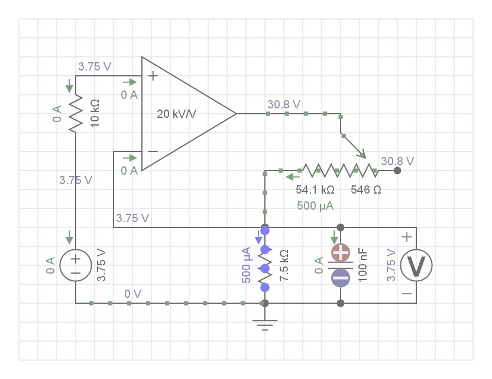

# Avox Go

Avox Go presents a straight-forward and simple interace, that allows adjustment of the magnitude and duration of the current, featuring one dial to adjust values and a button to confirm.

To start the process, a user will do the following:

1. Turn on the device
1. Set wanted current magnitude in micro-amperes [mA]
1. Set wanted duration for the process
1. Confirm and start the process

Once the process is started, the LCD-display will show a live feed of how many micro-amperes are going through each circuit, or "N/A" if a circuit is not closed, so that the user can monitor and make necessary changes.

Once the time limit is met, the current will be stopped, and the process can be started over.

The prototype supports up to 4 potatoes, but could be scaled up with 

## Core Circuit

Avox Go's objective is to supply a steady supply of current to connected potatoes.

The core element to do this is the potato circuit, or core cuircuit. It leverages an op-amp and a supplied voltage from an MCU to set a stable current.

Link to an online simulation using EveryCircuit:
https://everycircuit.com/circuit/5716353905590272

Circuit description:

> Power Supply for stable current delivery. Designed to Anders Keim Wulff-Vester's specifications.
> 
> Voltmeters are representing Analog Inputs of the MCU, and are rated at maximum 5V.
> 
> 5V supply is representing a variable DAC output from the MCU.
> 
> Limits the current delivered to a potato (represented by the first resistor after the op-amp's output).
> 
> At the default value of 500μA, the max potato resistance is 72.5kOhms.
> 
> **Changelog**
> 
> - Version 4.0 is the same core design as 3.0, and only PCB and MCU have negligble changes.
> - Version 3.0 adds voltage reading at sense resistor to measure current, and a 10k resistor to op-amp +.
> - Version 2.0 adds voltage reading and input through a microcontroller. This makes more precise and flexible input methods possible. Using an LCD, the user can be provided with relevant values and error messages.
> - Version 1.0 is the initial design

## Complete Electrical System

Avox Go features a PCB with four of the core circuits, controlled by an MCU - here an Arduino Nano, but it could be replaced with any similar unit.

**Legend**

Abbreviations follows typical convention for Ardiuno MCUs and electrical circuits, and custom symbols include the following:

- J: Connectors
- POT: Potato

Note that the current spec requires a 40V power supply. It could be replaced, but ensure relevant resistors are adjusted if doing so to not fry the MCU.